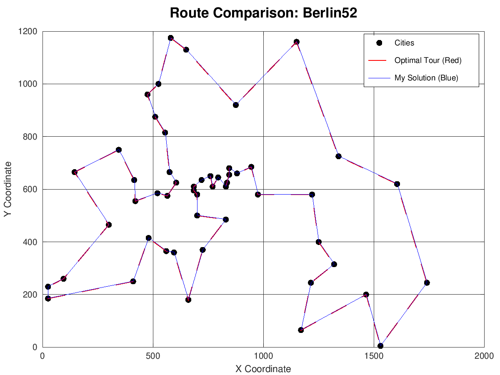
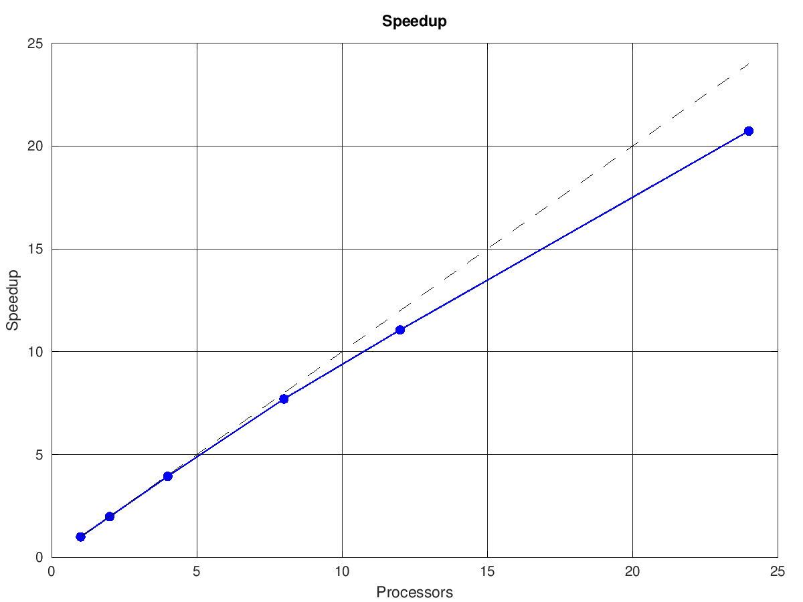
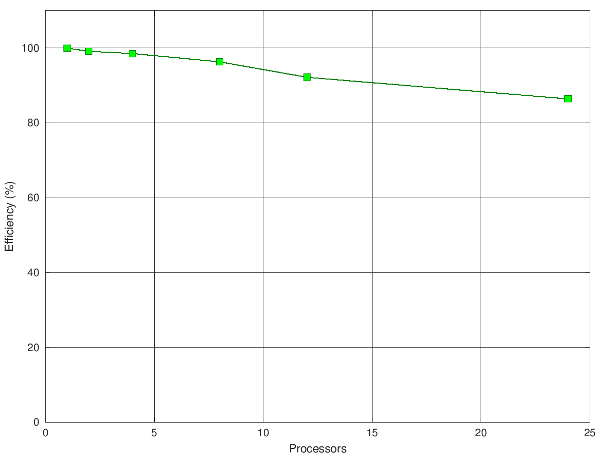
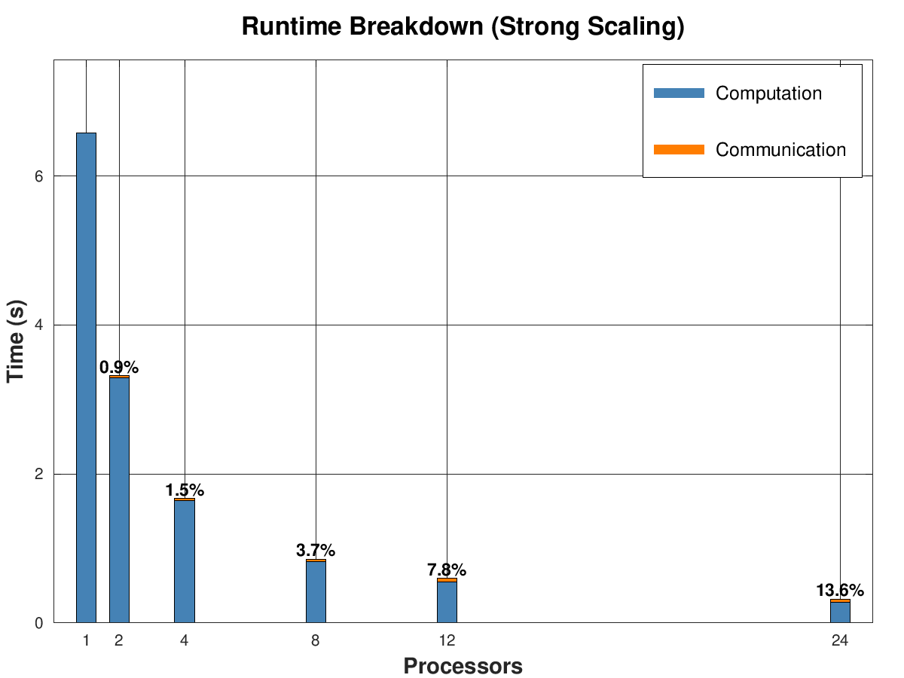
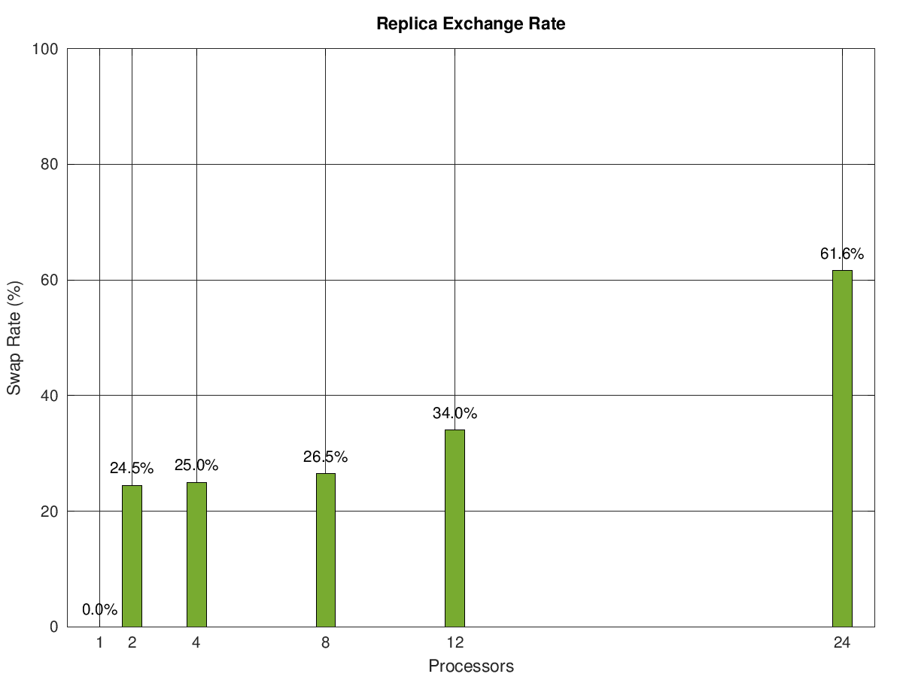
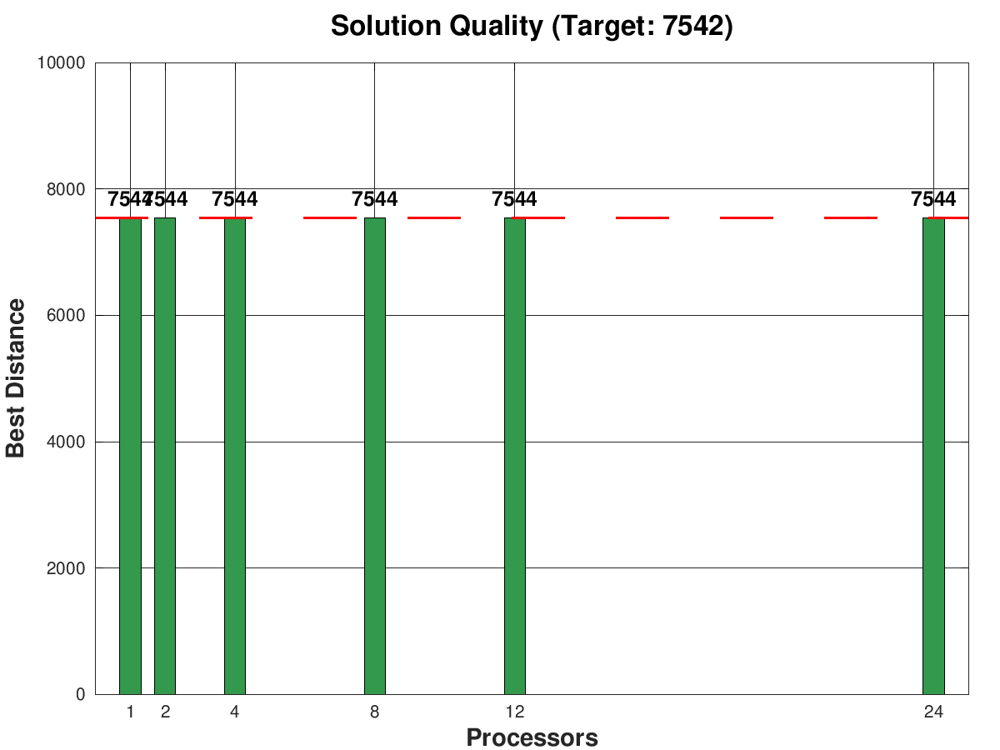

<p align="center">
  <a href="https://www.uni-wuppertal.de/en/">
    
  </a>
  <a href="https://www.open-mpi.org/">
    
  </a>
  <a href="https://en.cppreference.com/w/c">
    
  </a>
</p>

# **Distributed TSP Solver**
<p align="center">
  <a href="https://gcc.gnu.org/">
    
  </a>
  <a href="https://www.open-mpi.org/">
    
  </a>
  <a href="LICENSE">
    
  </a>
  <a href="#">
    
  </a>
</p> 

## 🚨 High-performance Parallel Tempering solver with O(1) arithmetic & deadlock-free synchronization
<p align="center">
  
</p>

## 📑 Table of Contents
- [Overview](#overview)  
- [Features](#features)  
- [Quick Start](#quick-start)
- [Theoretical Background](#theoretical-background)  
- [Code Implementation](#code-implementation)
- [Performance Metrics](#performance-metrics)  
- [Roadmap](#roadmap)  
- [Troubleshooting](#troubleshooting)
- [Acknowledgments](#acknowledgments)  
- [Contributing](#contributing)  
- [License](#license)

## Overview
This project delivers a <b>robust, scalable, and mathematically rigorous</b> framework for solving the Traveling Salesman Problem (TSP) on distributed clusters.  
It combines <b>Parallel Tempering (Replica Exchange)</b>, <b>Metropolis-Hastings MCMC</b>, and <b>low-level memory optimizations</b> to escape local minima in complex energy landscapes.  

Designed for:
- <b>HPC Engineers</b> analyzing strong scaling efficiency
- <b>Researchers</b> in combinatorial optimization
- <b>Systems Developers</b> interested in MPI synchronization patterns

## Features
🚀 <b>Massive Speedup</b> – Achieves <b>20.7x speedup</b> on 24 cores vs serial execution  
🔥 <b>Thermodynamic Tunneling</b> – Uses 24 temperature replicas to traverse non-convex landscapes  
🗺 <b>O(1) Delta Updates</b> – Precomputed distance matrices eliminate O(N) math bottlenecks  
🛡 <b>Deadlock Free</b> – Implements a synchronized "Odd-Even" handshake protocol  
📊 <b>Automated Analytics</b> – Full Bash/Octave pipeline for generating scaling graphs  
📈 <b>Visual Outputs</b> – Real-time route maps, efficiency plots & swap rate analysis

<p align="center">
  
</p>

## Quick Start

```bash
git clone [https://github.com/Kandil2001/Distributed-TSP-Solver.git](https://github.com/Kandil2001/Distributed-TSP-Solver.git)
cd Distributed-TSP-Solver
make

```

### Run a Single Instance

Solve the `berlin52` dataset using 4 processor cores:

```bash
mpirun -np 4 ./tsp_solver data/berlin52.tsp

```

### Run Full Scaling Benchmark

Execute the automated test suite (1-24 cores) and generate CSV logs:

```bash
./scripts/scaling_test.sh

```

## Theoretical Background

### 🔹 The Metropolis-Hastings Kernel

We model the TSP tour length as the energy of a physical system. The solver uses a <b>2-opt local search</b> move set. To satisfy detailed balance, moves are accepted with probability .

---

### 🔹 Parallel Tempering (Replica Exchange)

Standard Simulated Annealing often gets trapped in local minima. Parallel Tempering overcomes this by running multiple replicas at different temperatures and allowing them to <b>exchange states</b>.

This allows "cold" replicas to tunnel through high-energy barriers by swapping with "hot" replicas.

---

### 🔹 The Deadlock Problem

In distributed memory systems, a naive swap implementation leads to a <b>Circular Wait</b> (Deadlock) where every processor is waiting to send data.

We resolved this using a <b>Parity-Based Handshake Protocol</b>:

1. <b>Even Phase</b>: Ranks 2n ↔ 2n+1 communicate.
2. <b>Odd Phase</b>: Ranks 2n+1 ↔ 2n+2 communicate.

## Code Implementation

### 1. The O(1) Distance Lookup

Instead of calculating square roots in the inner loop, we precompute a lookup table (LUT). This reduces the complexity of a `get_delta` calculation from **O(N)** to **O(1)**.

```c
/* Precomputed Matrix Access - O(1) */
static inline double get_dist(int i, int j) {
    return dist_matrix[i * N_CITIES + j];
}

/* Delta Calculation using 4 edges */
double delta = (get_dist(cA, cB) + get_dist(cA_n, cB_n)) - 
               (get_dist(cA, cA_n) + get_dist(cB, cB_n));

```

### 2. Deadlock-Free Parity Handshake

We avoid circular waits by strictly ordering communication. Even ranks initiate swaps in even steps; odd ranks initiate in odd steps.

```c
/* Parity-Based Synchronization Logic */
int parity = step % 2;

// Even Phase: Rank 0 talks to 1, 2 talks to 3...
if (rank % 2 == parity && rank < size - 1) {
    // Initiate Swap with Right Neighbor
    MPI_Sendrecv(&my_energy, 1, MPI_DOUBLE, rank+1, ...);
} 
// Odd Phase: Rank 1 talks to 2, 3 talks to 4...
else if (rank % 2 != parity && rank > 0) {
    // Respond to Left Neighbor
    MPI_Recv(&partner_energy, 1, MPI_DOUBLE, rank-1, ...);
}

```

## Performance Metrics

Tested on: <b>24-Core Cluster, OpenMPI 4.1.0, GCC 9.3</b>

### 1. Strong Scaling & Efficiency

The system maintains high parallel efficiency (86%) even at 24 cores. The slight dip is expected due to Amdahl's Law and network latency.

<p align="center">


</p>
<i>Left: Efficiency drops slightly at 24 cores. Right: Computation (Metropolis) dominates, but Communication (Swap) overhead grows marginally.</i>

---

### 2. Thermodynamic Health (Swap Rates)

A critical success factor for Parallel Tempering is the <b>Swap Acceptance Rate</b>. As shown below, increasing the number of replicas (and thus density in temperature space) improves the swap probability, facilitating better tunneling through energy barriers.

<p align="center">

</p>

---

### 3. Solution Quality & Stability

A common risk in parallelization is "breaking" the algorithm logic. As shown below, our solver consistently finds the global optimum () across all core counts, proving the thermodynamic balance is preserved.

<p align="center">

</p>

## Roadmap

* [x] MPI Distributed Implementation
* [x] O(1) Matrix Optimization
* [x] Strong Scaling Analysis
* [ ] Hybrid OpenMP/MPI support
* [ ] GPU Acceleration (CUDA)

## Troubleshooting

**Q:** `mpirun` not found?

**A:** Ensure OpenMPI is installed: `sudo apt install openmpi-bin libopenmpi-dev`.

**Q:** Compiler errors with `sqrt`?

**A:** Ensure the linker flag `-lm` is present in the Makefile (included by default).

**Q:** Segmentation Fault?

**A:** Check that `data/berlin52.tsp` exists and is readable.

## Acknowledgments

This project was developed as a final thesis for the <b>High Performance Computing</b> course at the <b>Bergische Universität Wuppertal</b>. We extend our gratitude to:

* <b>Dr. T. Korzec</b> & <b>Dr. J. Koponen</b> for supervision and theoretical guidance.
* <b>The OpenMPI Project</b> for robust communication libraries.
* <b>The Scientific Computing Community</b> for foundational MCMC algorithms.

## Contributing

We welcome contributions of all kinds — bug fixes, performance improvements, documentation updates, and new features.

Please read our [CONTRIBUTING.md](https://www.google.com/search?q=CONTRIBUTING.md) for detailed contribution guidelines, coding standards, and workflow instructions before submitting a pull request.

## License

MIT License – see [LICENSE](https://www.google.com/search?q=LICENSE) for details.
