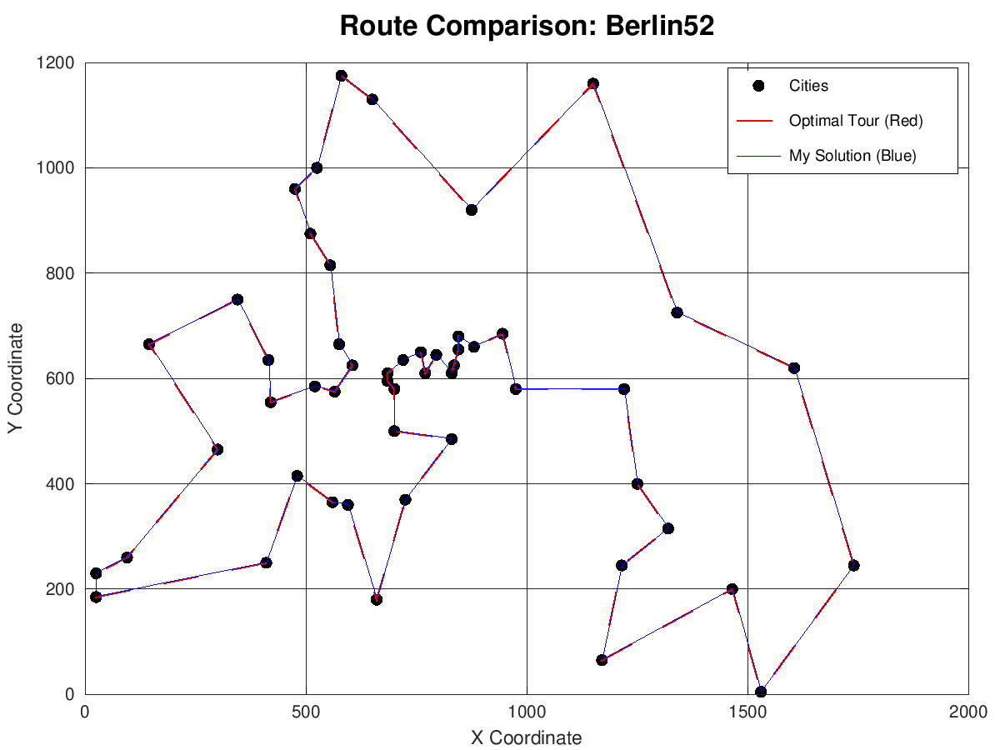
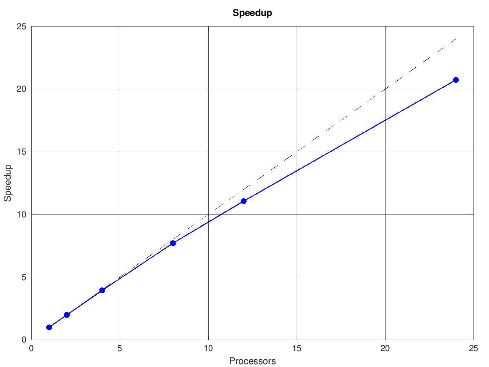
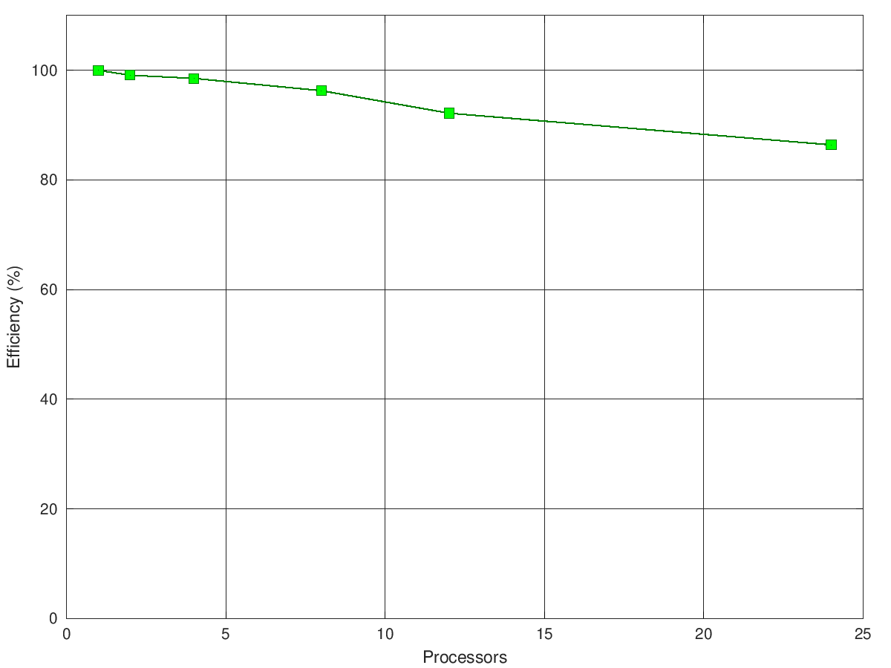
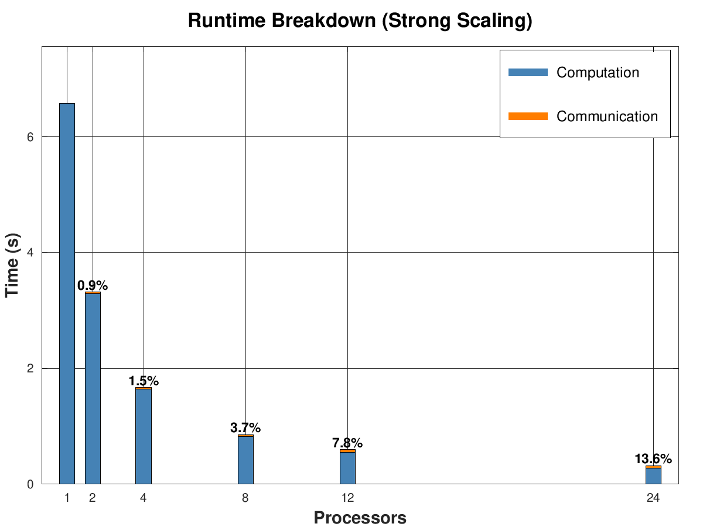
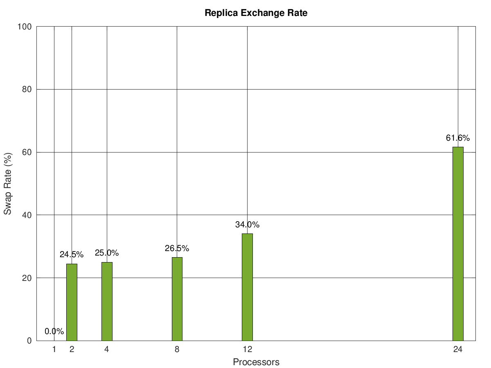
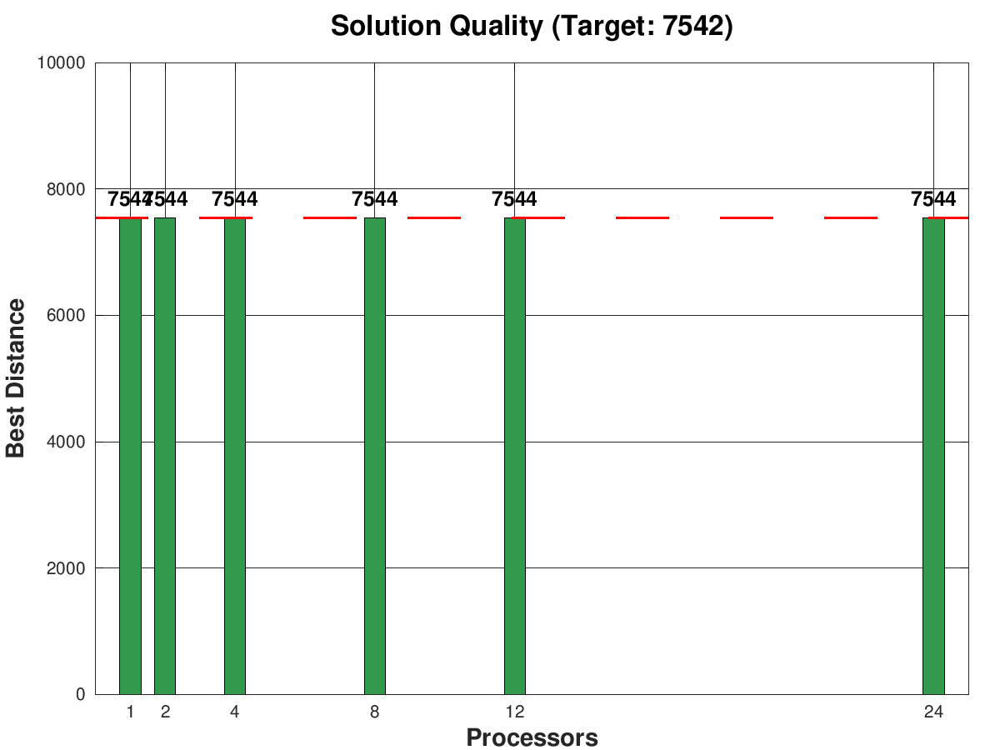

<p align="center">
  
</p>

# Distributed TSP Solver

A distributed-memory solver for the Traveling Salesman Problem, written in C and parallelized with MPI.

I built this project as part of a High Performance Computing course at Bergische Universität Wuppertal. The main goal was not only to find a good route, but also to explore how a stochastic optimization algorithm behaves when it is distributed across several processes.

The solver uses **parallel tempering**: every MPI process searches at a different temperature, and neighboring processes occasionally exchange solutions. Hot replicas explore more freely, while cold replicas focus on improving promising routes.

<p align="center">
  
  
  
</p>

## What this project demonstrates

- Distributed optimization using MPI
- Parallel tempering and Metropolis-Hastings sampling
- Deadlock-free communication between neighboring processes
- Constant-time route-cost updates for 2-opt moves
- Strong-scaling measurements across multiple core counts
- Automated result collection and visualization

## How the solver works

Each MPI process keeps its own copy of the route and runs a local Metropolis search at a different temperature.

During the search:

1. A process proposes a 2-opt move.
2. The change in route length is evaluated.
3. The move is accepted or rejected using the Metropolis criterion.
4. At fixed intervals, neighboring processes attempt to exchange routes.
5. The best route found across all processes is reported at the end.

The exchange step helps colder replicas escape local minima by temporarily receiving solutions from hotter replicas.

## Implementation details

### Constant-time 2-opt updates

The full route length does not need to be recalculated after every proposed move. Since a 2-opt move only replaces two edges, the change in distance can be calculated from four distance lookups.

```c
static inline double get_dist(int i, int j) {
    return dist_matrix[i * N_CITIES + j];
}

double delta =
    (get_dist(cA, cB) + get_dist(cA_n, cB_n))
    - (get_dist(cA, cA_n) + get_dist(cB, cB_n));
```

The distance matrix is precomputed once, making each lookup constant time.

### Deadlock-free replica exchange

A naive exchange pattern can leave processes waiting on one another. To avoid this, exchanges alternate between two pairing patterns:

- Even phase: ranks 0–1, 2–3, 4–5, ...
- Odd phase: ranks 1–2, 3–4, 5–6, ...

This keeps the communication pattern simple and prevents circular waits.

## Requirements

- A C compiler with C99 support
- OpenMPI or another compatible MPI implementation
- `make`
- Octave for generating the benchmark plots

On Ubuntu or Debian, the main dependencies can be installed with:

```bash
sudo apt install build-essential openmpi-bin libopenmpi-dev octave
```

## Build and run

Clone the repository and compile the solver:

```bash
git clone https://github.com/Kandil2001/Distributed-TSP-Solver.git
cd Distributed-TSP-Solver
make
```

Run the `berlin52` case using four MPI processes:

```bash
mpirun -np 4 ./tsp_solver data/berlin52.tsp
```

Run the automated scaling benchmark:

```bash
./scripts/scaling_test.sh
```

## Results

The benchmark was run on a 24-core cluster using OpenMPI 4.1.0 and GCC 9.3.

For the tested configuration, the parallel version reached a reported speedup of **20.7× on 24 cores**, corresponding to approximately **86% parallel efficiency**. The results also show the expected increase in communication overhead as more processes are added.

<p align="center">
  
</p>

<p align="center">
  
  
</p>

The swap-acceptance measurements help show whether replicas are exchanging solutions often enough for parallel tempering to work effectively.

<p align="center">
  
</p>

The route-quality comparison is included to check that increasing the number of processes improves runtime without noticeably reducing solution quality for the tested case.

<p align="center">
  
</p>

## Current limitations

This is an educational HPC project rather than a general-purpose TSP library. The current implementation focuses on one MPI-based parallel-tempering approach and was mainly evaluated using the included benchmark case.

Possible next steps include:

- Hybrid MPI and OpenMP parallelism
- CUDA acceleration
- Additional TSPLIB datasets
- More extensive statistical comparisons between runs
- Runtime configuration of temperatures and solver parameters

## Troubleshooting

### `mpirun` is not found

Install OpenMPI and its development package:

```bash
sudo apt install openmpi-bin libopenmpi-dev
```

### Linker error related to `sqrt`

Make sure the math library flag `-lm` is included during linking.

### The solver cannot open the input file

Check that the requested dataset exists and that the path is correct. For example:

```bash
ls data/berlin52.tsp
```

## Acknowledgments

This project was developed for the High Performance Computing course at Bergische Universität Wuppertal.

Thanks to **Dr. T. Korzec** and **Dr. J. Koponen** for their supervision and guidance during the course.

## License

This project is available under the [MIT License](LICENSE).
