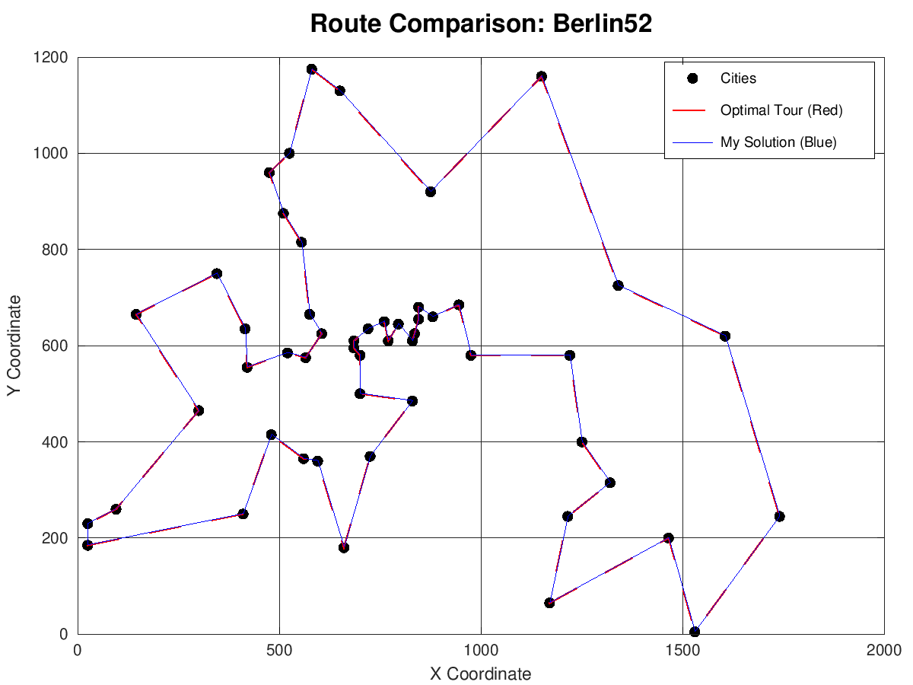
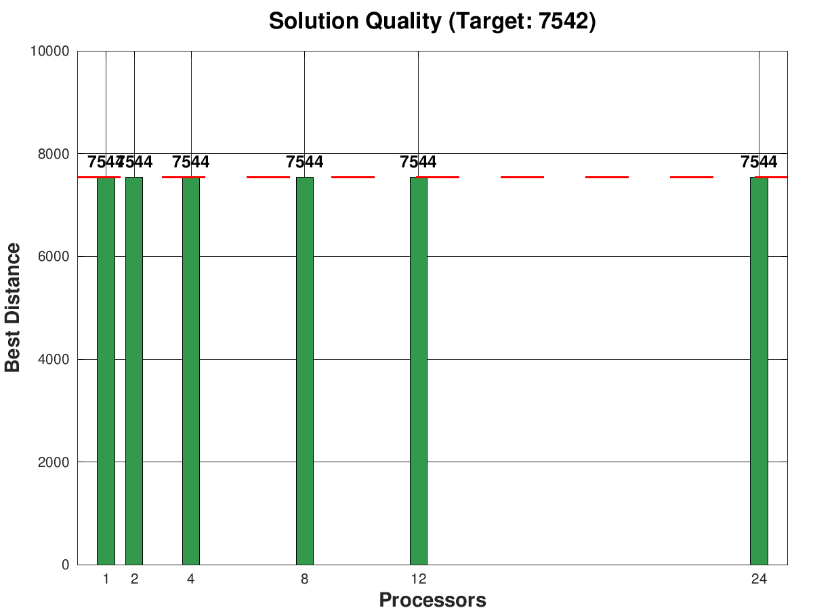

# Distributed TSP Solver

<p align="center">
  
  
  
  <a href="https://github.com/Kandil2001/Distributed-TSP-Solver/actions/workflows/ci.yml">
    
  </a>
  
  <a href="https://kandil2001.github.io/projects/distributed-tsp.html">
    
  </a>
</p>

A completed distributed-memory solver for the Traveling Salesman Problem, written in C and parallelized with MPI.

The project was developed for a High Performance Computing course at Bergische Universität Wuppertal. It uses parallel tempering to study how a stochastic optimization method behaves when multiple temperature replicas are distributed across MPI processes.

<p align="center">
  
</p>

## Main features

- distributed optimization with MPI
- parallel tempering with multiple temperature replicas
- Metropolis-Hastings acceptance logic
- two-opt route updates
- precomputed distance matrix for constant-time lookups
- deadlock-free communication between neighboring MPI ranks
- strong-scaling measurements across several process counts
- Octave scripts for runtime, efficiency, and route-quality plots
- GitHub Actions production build and two-rank smoke execution

## How the solver works

Each MPI process stores one or more route replicas. The replicas use different temperatures, allowing colder replicas to focus on local improvement while hotter replicas explore the search space more freely.

During the search:

1. a replica proposes a two-opt move
2. the route-length change is calculated
3. the move is accepted or rejected using the Metropolis criterion
4. neighboring replicas periodically attempt to exchange routes
5. the best route found across all processes is collected

The exchange step helps colder replicas leave local minima by receiving routes explored at higher temperatures.

## Implementation details

A two-opt move replaces only two edges, so the complete route length does not need to be recalculated after every proposal. The change is evaluated using four lookups from a precomputed distance matrix.

Communication alternates between two neighboring-rank patterns:

- even phase: ranks 0–1, 2–3, 4–5, ...
- odd phase: ranks 1–2, 3–4, 5–6, ...

This avoids circular waits and keeps replica exchange predictable.

## Results

The recorded course benchmark was run on a 24-core cluster using OpenMPI 4.1.0 and GCC 9.3.

For the tested Berlin52 configuration, the parallel version produced a reported speedup of **20.7× on 24 cores**, corresponding to approximately **86% parallel efficiency**.

<p align="center">
  
</p>

<p align="center">
  
  
</p>

<p align="center">
  
</p>

## Interpretation

The measurements document the completed course study for one stochastic configuration and one benchmark problem. They are specific to the tested cluster, compiler, MPI version, solver settings, and random behavior.

The reported speedup should not be interpreted as a general performance guarantee. Repeated runs with multiple random seeds and uncertainty statistics would be required for a stronger study of solution quality and stochastic variability.

## Running the code

On Ubuntu or Debian, install the main dependencies with:

```bash
sudo apt install build-essential openmpi-bin libopenmpi-dev octave
```

Build and run the included Berlin52 case:

```bash
git clone https://github.com/Kandil2001/Distributed-TSP-Solver.git
cd Distributed-TSP-Solver
make
mpirun -np 4 ./tsp_solver data/berlin52.tsp
```

Submit the cluster scaling study with:

```bash
sbatch script/scaling_test.sh
```

## Continuous integration

The GitHub Actions workflow performs two separate checks:

1. it builds the production solver with the unchanged scientific defaults
2. it builds a temporary reduced-iteration binary in the CI runner and executes it with two MPI ranks

The smoke run verifies that:

- MPI communication completes without hanging
- the global reduction returns a finite positive route length
- the saved route is a valid permutation of all 52 Berlin52 cities

The temporary iteration reduction is used only to keep CI fast. It does not change the repository’s production solver or the published scaling results.

## Repository structure

```text
script/tsp_mpi.c            MPI solver
script/scaling_test.sh      cluster scaling study
script/plot_*.m             Octave plotting scripts
data/berlin52.tsp           included benchmark case
figures/                    selected published plots
.github/workflows/ci.yml    production build and MPI smoke test
Makefile                    local build configuration
```

## Scope and limitations

This completed repository is an educational HPC project rather than a general-purpose TSP library.

The study is limited to:

- one MPI parallel-tempering approach
- the Berlin52 benchmark case
- one main recorded scaling experiment
- course-cluster hardware and software
- no repeated-seed uncertainty analysis

Possible extensions include hybrid MPI/OpenMP execution, CUDA acceleration, additional TSPLIB datasets, runtime configuration of temperature schedules, and repeated-seed statistics.

## Acknowledgments

This project was developed for the High Performance Computing course at Bergische Universität Wuppertal.

Thanks to **Dr. T. Korzec** and **Dr. J. Koponen** for their supervision and guidance.

## Author

Ahmed Kandil — [Portfolio](https://kandil2001.github.io/) · [LinkedIn](https://www.linkedin.com/in/ahmed-kandil03/) · [ORCID](https://orcid.org/0009-0007-2724-4565)

Released under the [MIT License](LICENSE).
