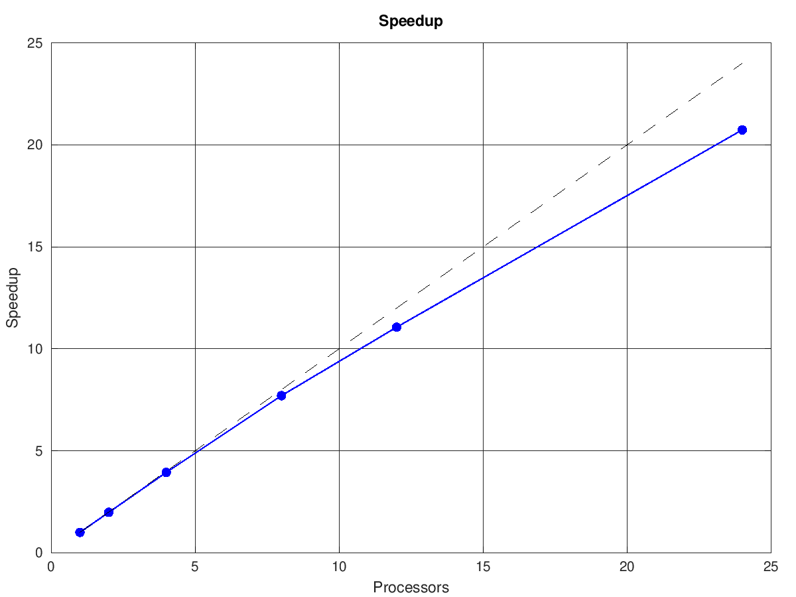
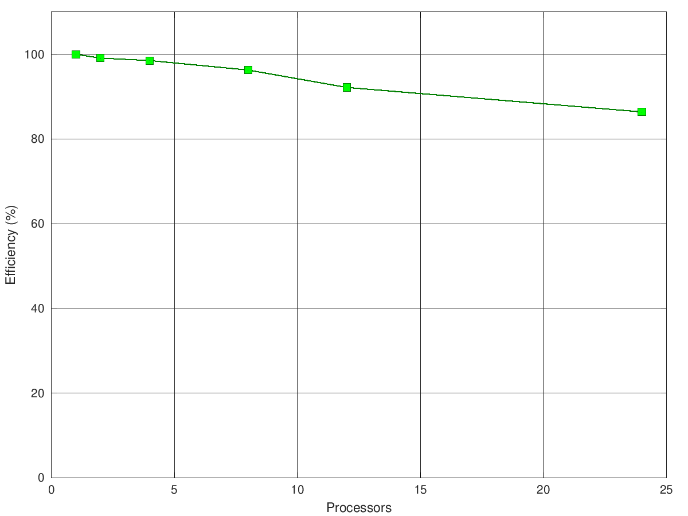
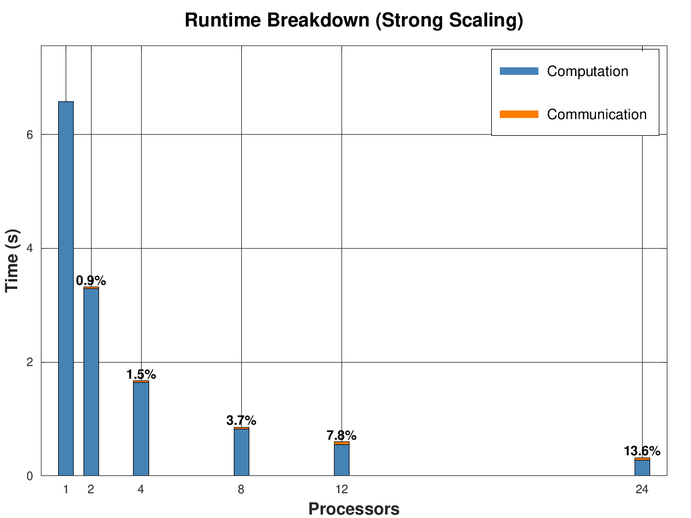

# Distributed TSP Solver

<p align="center">
  
  
  
  
  <a href="https://github.com/Kandil2001/Distributed-TSP-Solver/actions/workflows/ci.yml">
    
  </a>
  
  <a href="https://kandil2001.github.io/projects/distributed-tsp.html">
    
  </a>
</p>

A distributed-memory Traveling Salesman Problem solver written in C and parallelized with MPI.

The project was developed for a High Performance Computing course at Bergische Universität Wuppertal. It uses parallel tempering to study how a stochastic optimization method behaves when multiple temperature replicas are distributed across MPI processes.

## Important benchmark correction

The solver now follows the TSPLIB `EUC_2D` distance convention: each Euclidean edge length is rounded to the nearest integer before it contributes to the route weight.

The included official Berlin52 optimal tour is evaluated automatically and must produce:

```text
7542
```

Earlier course figures and the recorded `20.7×` speedup were generated with the previous raw floating-point Euclidean objective. Those historical timing figures are retained as evidence of the original course study, but they must not be interpreted as current TSPLIB-compatible route-quality results. The scaling study should be rerun with the corrected implementation before new performance and quality conclusions are published.

## Main features

- distributed optimization with MPI
- parallel tempering with 24 global temperature replicas
- Metropolis acceptance logic
- two-opt route updates
- TSPLIB-compatible `EUC_2D` edge weights
- precomputed distance matrix for constant-time lookups
- deadlock-free communication between neighboring MPI ranks
- optional deterministic base seed for reproducible runs
- official Berlin52 optimal-tour regression check
- GitHub Actions production build and two-rank smoke execution

## How the solver works

Each MPI process stores one or more route replicas. The replicas use different temperatures, allowing colder replicas to focus on local improvement while hotter replicas explore the search space more freely.

During the search:

1. a replica proposes a two-opt move
2. the route-weight change is calculated from four distance-matrix lookups
3. the move is accepted or rejected using the Metropolis criterion
4. neighboring replicas periodically attempt to exchange routes
5. the best route found across all processes is collected

The exchange step helps colder replicas leave local minima by receiving routes explored at higher temperatures.

## TSPLIB distance handling

The included instance declares:

```text
EDGE_WEIGHT_TYPE: EUC_2D
```

For two cities separated by `dx` and `dy`, the solver calculates:

```text
nint(sqrt(dx² + dy²))
```

where `nint` is the TSPLIB nearest-integer convention for non-negative distances. Unsupported edge-weight types are rejected instead of being interpreted silently.

City identifiers are validated when the instance is loaded, and the known optimal tour is stored in `data/berlin52.opt.tour` as a regression fixture.

## Build and run

On Ubuntu or Debian, install the main dependencies with:

```bash
sudo apt install build-essential openmpi-bin libopenmpi-dev octave
```

Build the production solver:

```bash
git clone https://github.com/Kandil2001/Distributed-TSP-Solver.git
cd Distributed-TSP-Solver
make
```

Run the Berlin52 case with a reproducible seed:

```bash
mpirun -np 4 ./tsp_solver data/berlin52.tsp --seed 12345
```

Without `--seed`, the solver uses the current time as the base seed.

Evaluate the included official optimal tour without running the stochastic search:

```bash
mpirun -np 1 ./tsp_solver \
  data/berlin52.tsp \
  --evaluate-tour data/berlin52.opt.tour
```

Expected output:

```text
Tour weight (TSPLIB EUC_2D): 7542
```

## Continuous integration

The GitHub Actions workflow performs three checks:

1. builds the unchanged production solver
2. evaluates the official Berlin52 optimal tour and requires a weight of `7542`
3. builds a temporary reduced-iteration binary and runs a deterministic two-rank MPI smoke case

The smoke run verifies that:

- MPI communication completes without hanging
- the global reduction returns a finite positive integer route weight
- the saved route is a valid permutation of all 52 Berlin52 cities

The temporary iteration reduction is used only to keep CI fast. It does not change the repository’s production solver.

## Historical course benchmark

The original course study used a 24-core cluster with OpenMPI 4.1.0 and GCC 9.3. It reported a speedup of **20.7× on 24 cores**, corresponding to approximately **86% parallel efficiency** for that historical implementation and configuration.

<p align="center">
  
</p>

<p align="center">
  
  
</p>

These plots are preserved as course-project artifacts. A new benchmark should use the corrected TSPLIB objective, fixed recorded seeds, repeated runs, and uncertainty statistics before the figures are replaced or promoted as current results.

## Repository structure

```text
script/tsp_mpi.c            MPI solver
script/scaling_test.sh      cluster scaling study
script/plot_*.m             Octave plotting scripts
data/berlin52.tsp           included TSPLIB benchmark instance
data/berlin52.opt.tour      official optimal-tour regression fixture
figures/                    historical course-study plots
.github/workflows/ci.yml    build, metric validation, and MPI smoke test
Makefile                    local build configuration
```

## Scope and limitations

This repository is an educational HPC project rather than a general-purpose TSP library.

The current scope is limited to:

- TSPLIB `EUC_2D` coordinate instances
- one MPI parallel-tempering implementation
- 24 compile-time global replicas
- the Berlin52 benchmark case
- compile-time temperature and iteration settings
- no repeated-seed uncertainty analysis yet

The corrected implementation and its regression tests are complete, but the historical scaling study has not yet been rerun under the corrected metric. Possible extensions include runtime configuration of the temperature schedule and replica count, repeated-seed statistics, hybrid MPI/OpenMP execution, CUDA acceleration, and additional TSPLIB datasets.

## Acknowledgments

This project was developed for the High Performance Computing course at Bergische Universität Wuppertal.

Thanks to **Dr. T. Korzec** and **Dr. J. Koponen** for their supervision and guidance.

## Author

Ahmed Kandil — [Portfolio](https://kandil2001.github.io/) · [LinkedIn](https://www.linkedin.com/in/ahmed-kandil03/) · [ORCID](https://orcid.org/0009-0007-2724-4565)

Released under the [MIT License](LICENSE).
